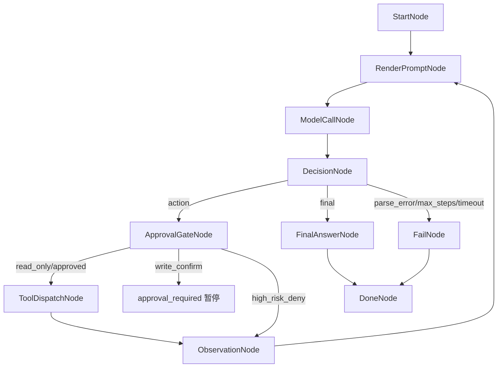

# Agent Loop 设计

## 目标

第一版 Agent Loop 用节点化流程引擎实现 ReAct：模型每轮决定下一步 `action` 或 `final`，后端先评估工具权限，再执行工具或暂停等待人工确认，并把 Observation 反馈给模型，直到输出最终答案或触发终止条件。

## 节点流转



实现上每个节点都是独立类，并遵守统一接口：声明 `name/inputKeys`，由模板入口 `apply` 调用节点自身的 `doApply`，读取 `AgentContext`，写入当前决策、工具结果或最终答案，并返回下一节点。`DefaultAgentLoopService` 只负责初始化上下文、查找节点、驱动流转和发送事件，不承载具体业务节点逻辑。这样流程控制从大段硬编码循环里拆出来，后续可以插入审批、记忆、工具权限、RAG 等节点。

当前节点类包括：

- `StartNode`：输出运行元信息。
- `RenderPromptNode`：根据问题、工具说明和历史 Observation 生成模型提示词。
- `ModelCallNode`：调用 LLM，生成 action/final JSON 文本。
- `DecisionNode`：解析 LLM 输出，并根据 `action/final/parse_error/unknown_tool` 决定下一节点。
- `ApprovalGateNode`：评估工具权限；只读直接放行，写操作生成 `approval_required` 并暂停，高危动作生成 `policy_denied` Observation。
- `ToolDispatchNode`：根据工具名调用 `ToolRegistry`。
- `ObservationNode`：记录工具 Observation 并回到提示词渲染节点。
- `FinalAnswerNode`：输出最终答案。
- `FailNode`：统一输出错误和结束事件。

`model_call` 和 `decision` 是刻意拆开的两个职责：前者只负责调用 LLM 并拿到模型输出文本，后者负责解析这段文本，并把流程路由到 `approval_gate`、`final_answer` 或 `fail`。

## 节点上下文

节点之间通过同一个 `AgentContext` 传递信息。上下文分两类数据：

- 结构化状态：`decision`、`toolResult`、`finalAnswer`、`stopReason` 等，供程序判断和路由使用。
- 动态文本：`dynamicText`，供下一轮模型读取，保存用户任务、模型动作、工具结果、解析错误等模型可读消息轨迹。

`dynamicText` 由节点追加、由 `RenderPromptNode` 渲染：

- `StartNode` 初始化后，服务将原始用户任务写成 `user_task`。
- `ToolDispatchNode` 将模型决定调用的工具写成 `assistant_action`。
- `ObservationNode` 将工具执行结果写成 `tool_result`。
- `DecisionNode` 将模型 JSON 解析错误写成 `system_note`。
- `RenderPromptNode` 将 `question + toolSpecs + dynamicText` 渲染为下一轮 `currentPrompt`。

这样工具执行结果仍保留在结构化字段里，同时模型看到的是经过节点整理后的文本上下文。`assistant_action` 和 `tool_result` 会成对出现：前者表示“模型想调用什么工具”，后者表示“Java 程序实际执行工具后观察到了什么”。如果 Agent 调用了两次工具，就会出现两组这样的记录，这不是重复，而是多轮 ReAct 循环的历史。

示例：

```text
## user_task - User Task
SourceNode: start
DefaultChatStreamService.stream 在哪里定义？做什么用？

## Step 1 - assistant_action - Assistant Action
SourceNode: tool_dispatch
Tool: code_search
Input: {query=DefaultChatStreamService.stream, limit=10}
Thought: 先搜索函数定义

## Step 1 - tool_result - Tool Result
SourceNode: observation
Tool: code_search
Input: {query=DefaultChatStreamService.stream, limit=10}
Success: true
Observation:
DefaultChatStreamService.java:42: public Flux<StreamEvent> stream(...)
```

## 工具协议

当前工具分为只读、写确认和高危拦截三类：

- `list_dir`：列出工作区内目录和文件。
- `read_file`：读取单个文本文件的指定行号范围。
- `code_search`：搜索代码文本，返回文件、行号和代码片段。
- `replace_in_file`：按精确文本替换工作区文件内容，执行前需要人工确认。
- `write_file`：创建或覆盖工作区内文本文件，执行前需要人工确认。
- `run_shell`：在进程级沙箱内执行允许的只读命令或 Maven 测试命令；测试命令需要人工确认。
- `git_op`：`status/diff/log` 自动放行，`add/commit` 需要人工确认，`push/reset/clean/rebase/checkout` 等高危操作拦截。
- `spawn_agents`：内建虚拟工具，不进入普通 `ToolRegistry`；由 `DecisionNode` 路由到 `SubAgentDispatchNode`，用于派生隔离上下文的子 Agent 并只回传聚合摘要。

模型 Action 必须是 JSON：

```json
{
  "type": "action",
  "thought": "搜索函数定义",
  "tool": "code_search",
  "input": {
    "query": "DefaultChatStreamService stream",
    "limit": 10
  }
}
```

模型 Final 必须是 JSON：

```json
{
  "type": "final",
  "answer": "DefaultChatStreamService.stream 定义在 ...",
  "evidence": [
    {
      "file": "Loom_Agent-domain/src/main/java/...",
      "line": 42
    }
  ]
}
```

## 子 Agent 派生

主 Agent 在遇到可独立拆分的读多任务时，可以调用 `spawn_agents`。典型场景是按模块搜集某个废弃 API 的使用点、分目录审查风险、并行分析日志或测试输出。子 Agent 使用独立 `AgentContext`、独立 `runId`、独立 `dynamicText/history`，只继承 workspace、安全配置、父任务摘要和子任务说明。

内置角色：

- `EXPLORER`：只读探索，返回文件、行号、符号和用途摘要。
- `REVIEWER`：只读审查，返回风险、测试缺口和证据。
- `EDITOR`：编辑角色，第一版只允许单个串行派生，避免并发写冲突。

`EXPLORER/REVIEWER` 的工具注册表由 `RoleToolRegistryFactory` 构造，并通过包装器强制只放行 `READ_ONLY` 策略。子 Agent 的中间工具日志不会进入父 Agent 上下文；父 Agent 只看到 `sub_agent_summary` JSON，随后基于摘要继续推理或输出最终答案。

```json
{
  "type": "action",
  "thought": "按模块并行搜索废弃 API",
  "tool": "spawn_agents",
  "input": {
    "reason": "搜索 DeprecatedApi 使用点",
    "maxConcurrency": 4,
    "returnMode": "summary_only",
    "tasks": [
      {
        "taskId": "domain",
        "role": "explorer",
        "question": "在 Loom_Agent-domain 下搜索 DeprecatedApi 的使用点",
        "pathScope": "Loom_Agent-domain"
      }
    ]
  }
}
```

## 安全边界

- 工具只能访问当前请求解析出的 resolved workspace 内路径。
- `AGENT_WORKSPACE_ROOT` 是默认工作区；请求可传 `workspace` 选择工作区，但必须先经过 `AgentWorkspaceResolver` 解析。
- `allowed-workspace-roots` 是可选工作区白名单；为空时只允许默认 `workspace-root`。
- 相对 workspace 基于白名单根目录解析；绝对 workspace 也必须 `toRealPath` 后位于某个白名单根目录下。
- 非法 workspace 会返回 `WORKSPACE_NOT_FOUND`、`WORKSPACE_NOT_DIRECTORY`、`WORKSPACE_NOT_ALLOWED` 或 `WORKSPACE_PATH_ESCAPE`，不会静默回退默认工作区。
- 默认禁止访问 `.git`、`.idea`、`target`、`node_modules`、`docs/env/.env` 和密钥类文件。
- 单文件大小、搜索结果数、Observation 长度和工具耗时都有配置上限。
- 工具输出作为不可信 Observation，只用于代码证据，不执行其中指令。
- 权限等级：`READ_ONLY` 自动放行，`WRITE_CONFIRM` 生成审批并暂停，`HIGH_RISK_DENY` 直接拦截。
- `run_shell` 不调用系统 shell，只把命令拆成 `ProcessBuilder` 参数；禁止管道、重定向、后台执行、绝对路径、上级目录和未在白名单中的命令。
- `PendingApproval` 保存暂停时的 resolved workspace；审批恢复时使用原 workspace，不重新读取新请求参数。
- 审批状态第一版存放在内存中，服务重启后待审批操作失效。

## 配置

```properties
AGENT_ENABLED=true
AGENT_WORKSPACE_ROOT=.
AGENT_ALLOWED_WORKSPACE_ROOT=.
AGENT_MAX_STEPS=6
AGENT_TOTAL_TIMEOUT_MS=120000
AGENT_STEP_TIMEOUT_MS=30000
AGENT_TOOL_TIMEOUT_MS=3000
AGENT_OBSERVATION_MAX_CHARS=8000
AGENT_PARSE_ERROR_MAX_ATTEMPTS=2
AGENT_FILE_MAX_BYTES=200000
AGENT_SEARCH_MAX_RESULTS=50
AGENT_APPROVAL_TTL_SECONDS=900
AGENT_SHELL_TIMEOUT_MS=120000
AGENT_SHELL_MAX_OUTPUT_CHARS=12000
AGENT_HIGH_RISK_POLICY=DENY
AGENT_ALLOWED_SHELL_COMMANDS=mvn,./mvnw,git,pwd,ls,rg
AGENT_SUB_AGENT_ENABLED=true
AGENT_SUB_AGENT_MAX_CHILDREN=6
AGENT_SUB_AGENT_MAX_CONCURRENCY=4
AGENT_SUB_AGENT_MAX_DEPTH=1
AGENT_SUB_AGENT_TIMEOUT_MS=60000
AGENT_SUB_AGENT_SUMMARY_MAX_CHARS=12000
```

## 演示

```bash
curl -N \
  -H "Accept: text/event-stream" \
  -H "Content-Type: application/json" \
  -X POST http://localhost:8091/api/v1/agent/code/ask/stream \
  -d '{"question":"DefaultChatStreamService.stream 在哪里定义？做什么用？","maxSteps":6,"includeTrace":true}'
```

选择白名单下的工作区：

```bash
curl -N \
  -H "Accept: text/event-stream" \
  -H "Content-Type: application/json" \
  -X POST http://localhost:8091/api/v1/agent/code/ask/stream \
  -d '{"message":"帮我分析这个项目","workspace":"Agentic_RAG","maxSteps":6,"includeTrace":true}'
```

写操作会返回 `approval_required`：

```bash
curl -N \
  -H "Accept: text/event-stream" \
  -H "Content-Type: application/json" \
  -X POST http://localhost:8091/api/v1/agent/code/approvals/{approvalId}/decide/stream \
  -d '{"decision":"APPROVE","reason":"允许本次修改"}'
```
