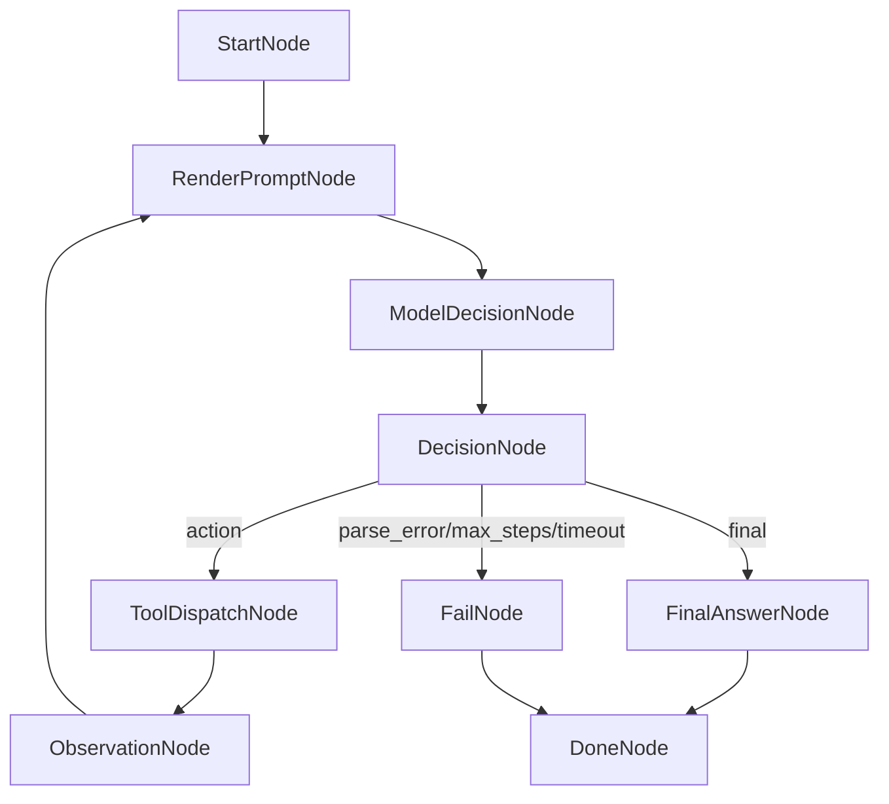

# Agent Loop 设计

## 目标

第一版 Agent Loop 用节点化流程引擎实现 ReAct：模型每轮决定下一步 `action` 或 `final`，后端执行只读工具并把 Observation 反馈给模型，直到输出最终答案或触发终止条件。

## 节点流转



实现上每个节点都是独立类，并遵守统一接口：声明 `name/inputKeys`，由模板入口 `apply` 调用节点自身的 `doApply`，读取 `AgentContext`，写入当前决策、工具结果或最终答案，并返回下一节点。`DefaultAgentLoopService` 只负责初始化上下文、查找节点、驱动流转和发送事件，不承载具体业务节点逻辑。这样流程控制从大段硬编码循环里拆出来，后续可以插入审批、记忆、工具权限、RAG 等节点。

当前节点类包括：

- `StartNode`：输出运行元信息。
- `RenderPromptNode`：根据问题、工具说明和历史 Observation 生成模型提示词。
- `ModelDecisionNode`：调用模型生成 action/final JSON。
- `DecisionNode`：解析 LLM 输出，并根据 `action/final/parse_error/unknown_tool` 决定下一节点。
- `ToolDispatchNode`：根据工具名调用 `ToolRegistry`。
- `ObservationNode`：记录工具 Observation 并回到提示词渲染节点。
- `FinalAnswerNode`：输出最终答案。
- `FailNode`：统一输出错误和结束事件。

## 节点上下文

节点之间通过同一个 `AgentContext` 传递信息。上下文分两类数据：

- 结构化状态：`decision`、`toolResult`、`finalAnswer`、`stopReason` 等，供程序判断和路由使用。
- 动态文本：`dynamicText`，供下一轮模型读取，保存用户任务、模型动作、工具结果、解析错误等模型可读消息轨迹。

`dynamicText` 由节点追加、由 `RenderPromptNode` 渲染：

- `StartNode` 初始化后，服务将原始用户任务写成 `user_task`。
- `ToolDispatchNode` 将模型决定调用的工具写成 `assistant_action`。
- `ObservationNode` 将工具执行结果写成 `tool_result`。
- `DecisionNode` 将模型 JSON 解析错误写成 `system_note`。
- `RenderPromptNode` 将 `question + toolSpecs + dynamicText` 渲染为下一轮 `currentPrompt`。

这样工具执行结果仍保留在结构化字段里，同时模型看到的是经过节点整理后的文本上下文。`assistant_action` 和 `tool_result` 会成对出现：前者表示“模型想调用什么工具”，后者表示“Java 程序实际执行工具后观察到了什么”。如果 Agent 调用了两次工具，就会出现两组这样的记录，这不是重复，而是多轮 ReAct 循环的历史。

示例：

```text
## user_task - User Task
SourceNode: start
DefaultChatStreamService.stream 在哪里定义？做什么用？

## Step 1 - assistant_action - Assistant Action
SourceNode: tool_dispatch
Tool: code_search
Input: {query=DefaultChatStreamService.stream, limit=10}
Thought: 先搜索函数定义

## Step 1 - tool_result - Tool Result
SourceNode: observation
Tool: code_search
Input: {query=DefaultChatStreamService.stream, limit=10}
Success: true
Observation:
DefaultChatStreamService.java:42: public Flux<StreamEvent> stream(...)
```

## 工具协议

当前只注册三个只读工具：

- `list_dir`：列出工作区内目录和文件。
- `read_file`：读取单个文本文件的指定行号范围。
- `code_search`：搜索代码文本，返回文件、行号和代码片段。

模型 Action 必须是 JSON：

```json
{
  "type": "action",
  "thought": "搜索函数定义",
  "tool": "code_search",
  "input": {
    "query": "DefaultChatStreamService stream",
    "limit": 10
  }
}
```

模型 Final 必须是 JSON：

```json
{
  "type": "final",
  "answer": "DefaultChatStreamService.stream 定义在 ...",
  "evidence": [
    {
      "file": "Loom_Agent-domain/src/main/java/...",
      "line": 42
    }
  ]
}
```

## 安全边界

- 工具只能读取 `AGENT_WORKSPACE_ROOT` 内路径。
- 默认禁止读取 `.git`、`.idea`、`target`、`node_modules`、`docs/env/.env` 和密钥类文件。
- 单文件大小、搜索结果数、Observation 长度和工具耗时都有配置上限。
- 工具输出作为不可信 Observation，只用于代码证据，不执行其中指令。

## 配置

```properties
AGENT_ENABLED=true
AGENT_WORKSPACE_ROOT=.
AGENT_MAX_STEPS=6
AGENT_TOTAL_TIMEOUT_MS=120000
AGENT_STEP_TIMEOUT_MS=30000
AGENT_TOOL_TIMEOUT_MS=3000
AGENT_OBSERVATION_MAX_CHARS=8000
AGENT_PARSE_ERROR_MAX_ATTEMPTS=2
AGENT_FILE_MAX_BYTES=200000
AGENT_SEARCH_MAX_RESULTS=50
```

## 演示

```bash
curl -N \
  -H "Accept: text/event-stream" \
  -H "Content-Type: application/json" \
  -X POST http://localhost:8091/api/v1/agent/code/ask/stream \
  -d '{"question":"DefaultChatStreamService.stream 在哪里定义？做什么用？","maxSteps":6,"includeTrace":true}'
```
