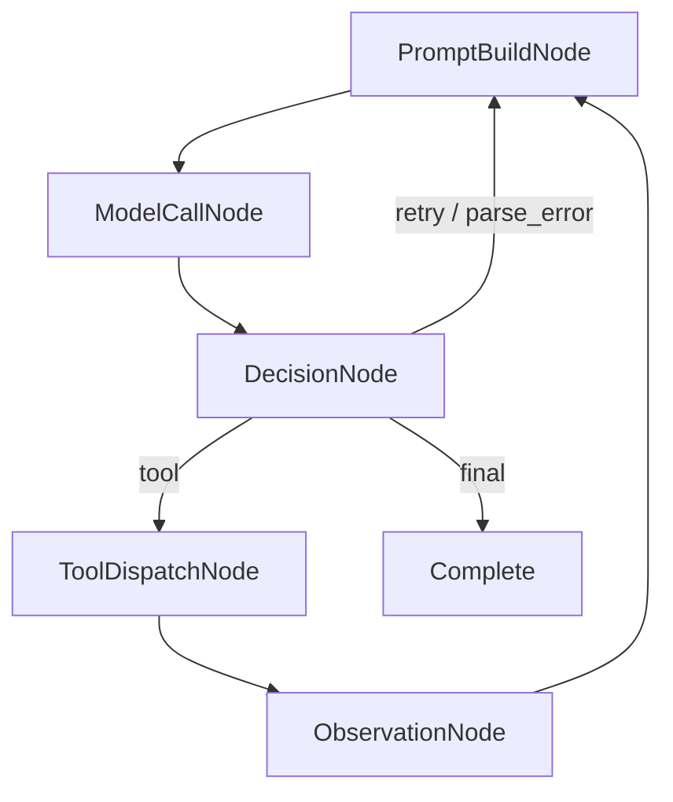

# Agent Loop 设计

## 目标

Agent Loop 用节点化流程引擎实现 Loom Code 风格 ReAct：模型每轮输出一个 Loom XML 决策（`<tool>` 调用或 `<final>` 答案），`DecisionNode` 解析并路由，`ToolDispatchNode` 通过唯一执行入口 `ToolExecutor` 执行工具，Observation 反馈给模型，直到输出最终答案或触发终止条件。

## 调用链

```text
CLI → SessionRuntime → AgentLoop → Prompt/Model → Loom XML Parser → ToolExecutor → Tool/FileStore
```

## 节点流转


```mermaid
flowchart TD
    A["PromptBuildNode"] --> B["ModelCallNode"]
    B --> C["DecisionNode"]
    C -->|tool| D["ToolDispatchNode"]
    D --> E["ObservationNode"]
    E --> A
    C -->|final| F["Complete"]
    C -->|retry / parse_error| A
```

节点类：

- `PromptBuildNode`：组稳定前缀（工具说明、调用规则、示例、Workspace Facts）与动态上下文（memory/history/current request）。
- `ModelCallNode`：调用 LLM，拿到模型输出文本（纯文本，无 JSON 输出约束）。
- `DecisionNode`：Loom XML 解析，按固定优先级：
  1. `<tool>{...json...}</tool>`（JSON 对象）；
  2. 带属性/子标签的 XML tool（`write_file`/`delegate` 支持 body 回退）；
  3. `<final>...</final>`；
  4. 非空裸文本作为 final；
  5. 空文本或非法结构进入格式重试。
  格式重试只增加模型尝试次数，不消耗工具 step。
- `ToolDispatchNode`：构造 `ToolCall` 并交给唯一入口 `ToolExecutor`。
- `ObservationNode`：把工具结果写入 ledger/history，回到提示词渲染节点。

## 工具治理（ToolExecutor）

所有工具调用只允许经过 `ToolExecutor`，固定检查顺序：

1. `allowedTools` 白名单
2. 工具是否存在
3. 参数解析 + 语义校验（在审批之前）
4. 连续重复调用检测（第三次相同调用拒绝，被拒调用也写入历史）
5. `readOnly` 与审批策略（ask/auto/never）
6. 风险工具执行前工作区快照（SHA-256）
7. 执行工具
8. 全局裁剪输出至 4000 字符
9. 风险工具执行后快照与 diff（`created:` / `deleted:` / `modified:`）
10. 更新 memory / process note
11. 统一 metadata 与观察事件

状态判定：

- 风险工具成功且工作区正常：`success`
- shell 非零退出且未修改工作区：`error`
- shell 非零退出或异常但工作区已改变：`partial_success`
- 准入、重复或审批拒绝：`rejected`

`delegate` 子 Agent：继承工作区、provider/model、环境与文件存储；`readOnly=true`、`approval=never`；只可见六个基础工具；默认最多 3 steps；父历史摘要注入最多 300 字符。

## 节点上下文

节点之间通过同一个 `AgentContext` 传递信息：

- 结构化状态：`decision`、`toolResult`、`finalAnswer`、`stopReason` 等。
- 会话历史：`ConversationHistory`（ledger），由 `ConversationHistoryAppendService` 幂等追加。
- 工作记忆：`WorkingContextMemory`（任务摘要、最近文件、文件摘要、过程笔记）。

## 会话与运行轨迹

- 会话持久化：`FileSessionStore`（`.loom-code/sessions/<sessionId>.json`），保存 history/memory/checkpoints/workspaceRoot/创建时间/runtime identity。
- 运行轨迹：`FileRunStore`（`.loom-code/runs/<runId>/`），`task_state.json`、`trace.jsonl`（追加）、`report.json`（原子写）。
- `--resume latest` 选择当前工作区最近更新的合法 session；workspace 不一致拒绝恢复。
- REPL 复用同一 session；`/reset` 清空历史/记忆/checkpoint，保留 session id 与工作区。
