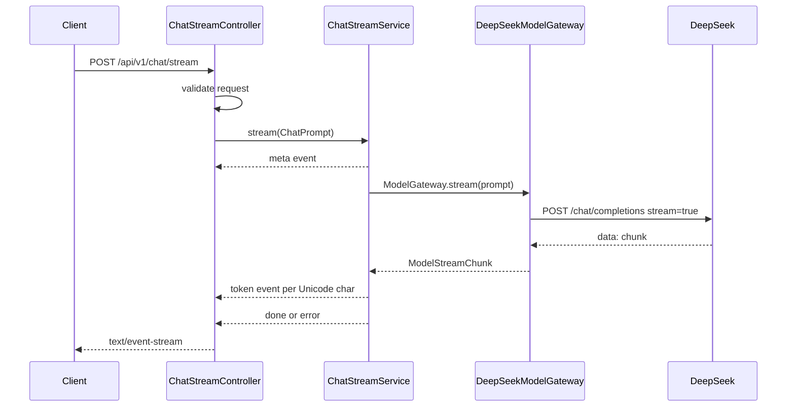

# 后端架构设计

## 目标

v1 实现 Agent 的稳定基础链路：HTTP 请求进入后端，后端调用 DeepSeek，按 SSE 逐字返回模型输出，并在异常场景下返回结构化兜底事件。同时支持子 Agent 派生与隔离执行。

## 分层

- API 层定义对外 DTO，不依赖 Spring MVC 或业务实现。
- Trigger 层只做 HTTP/SSE 适配、参数校验、事件发送和非流式异常兜底。
- Domain 层定义模型调用端口 `ModelGateway`，实现 `ChatStreamService` 的重试、超时、逐字切分、finish reason 处理和输出校验。
- Infrastructure 层实现 DeepSeek `/chat/completions` SSE 解析，并提供 MyBatis/Redis 基础设施。
- App 层装配 `ModelRuntimeProperties`、`ChatStreamService`、启动类和运行配置。

## 数据流

## SSE 契约

事件名固定为 `meta`、`token`、`done`、`error`。事件数据都包含 `type`，方便客户端同时按 SSE event name 或 JSON 字段解析。

`responseFormat=JSON_OBJECT` 时，Domain 层会聚合完整输出并用 Jackson 校验 JSON。校验失败时仍保留已流出的 token，再发送 `error: validation_error`。

## 配置

本地配置放在 `docs/env/.env`，仓库只提交 `docs/env/.env.example`。

关键变量：

- `DEEPSEEK_API_KEY`
- `DEEPSEEK_BASE_URL`
- `DEEPSEEK_MODEL`
- `DEEPSEEK_TEMPERATURE`
- `DEEPSEEK_MAX_TOKENS`
- `AI_CONNECT_TIMEOUT_MS`
- `AI_FIRST_TOKEN_TIMEOUT_MS`
- `AI_STREAM_TIMEOUT_MS`
- `AI_RETRY_MAX_ATTEMPTS`

默认模型为 `deepseek-v4-flash`，可通过 env 切到 `deepseek-v4-pro`。

## 异常策略

- 请求参数错误：Controller 返回 SSE `error`，code 为 `invalid_request`。
- API key 缺失：启动校验失败；如果运行时配置为空，则返回 `config_error`。
- DeepSeek 401/402/400/422：不重试，直接映射为鉴权、余额或非法请求错误。
- DeepSeek 429/500/503：如果还没有输出 token，则按指数退避重试；一旦已经输出 token，不再重试，避免客户端收到重复内容。
- `finish_reason=length/content_filter/insufficient_system_resource`：转为 `error` 事件。

## 后续演进

后续接入 Agentic RAG、工具执行和多 Agent 时，保持 Controller 契约不变，优先扩展 Domain 层的编排服务和 Infrastructure 层的工具/检索适配器。
